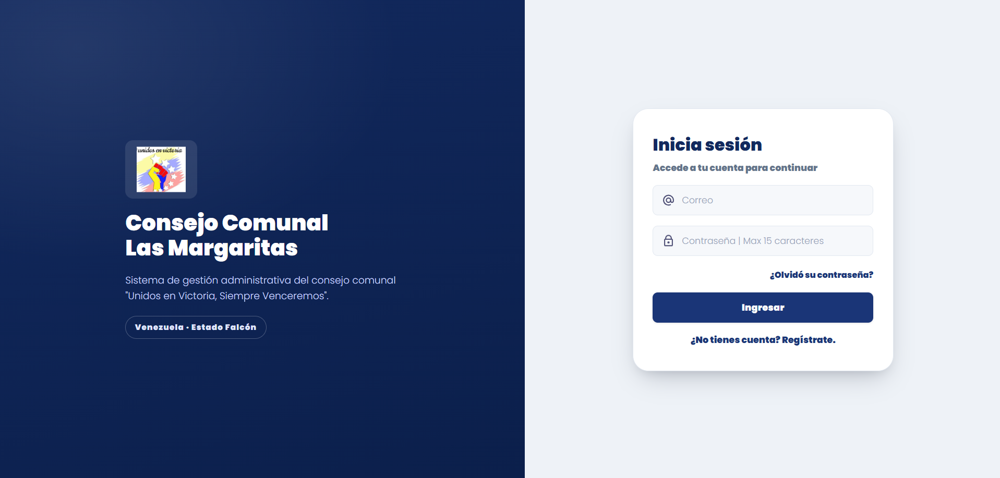
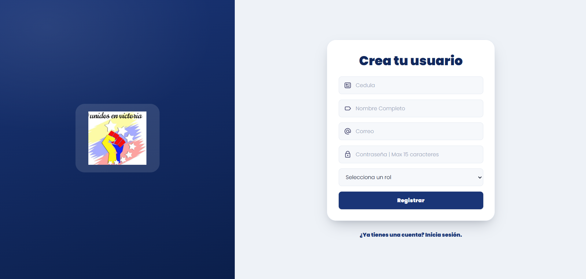
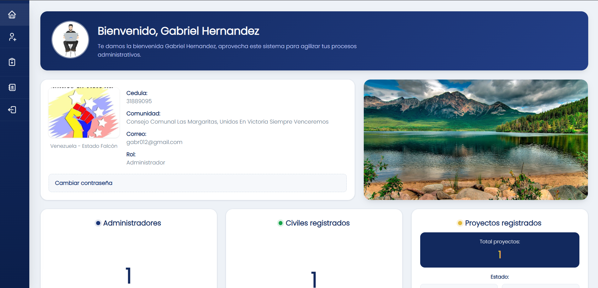

<p align="center">
  
</p>

<h1 align="center">Consejo Comunal Las Margaritas</h1>

<p align="center">
  Sistema de gestión administrativa para el Consejo Comunal <strong>"Unidos en Victoria, Siempre Venceremos"</strong>
  de Las Margaritas, sector 2 (Cardón, Estado Falcón, Venezuela).
</p>

<p align="center">
  
</p>

---

## Descripción

Plataforma web que permite a los voceros del consejo comunal administrar:

- **Registro civil de la comunidad** (miembros, comités, carnet de la patria, centro y tipo de votación).
- **Gestión de proyectos comunitarios** (crear, presupuestar, modificar, visualizar gastos y eliminar).
- **Usuarios administradores** con autenticación y recuperación de contraseña por preguntas de seguridad.

Todo el flujo está en español y con una interfaz moderna (modales, toasts y notificaciones por campo).

## Vista previa

### Autenticación

| Inicio de sesión | Registro de administrador |
| --- | --- |
|  |  |

### Panel principal

<p align="center">
  
</p>

### Registro Civil

| Elegir opción | Formulario de alta |
| --- | --- |
|  |  |

| Consulta de ciudadanos |
| --- |
|  |

### Gestión de Proyectos

<p align="center">
  
</p>

### Contacto

<p align="center">
  
</p>

## Características

| Módulo | Funcionalidades |
| --- | --- |
| **Autenticación** | Inicio de sesión, registro de administradores y recuperación de contraseña (identificación por cédula → preguntas de seguridad → nueva contraseña). |
| **Panel / Menú principal** | Bienvenida, indicadores (administradores, civiles registrados, proyectos y su estado) y última conexión. |
| **Registro Civil** | Alta de ciudadanos con validación por campo, tabla con búsqueda (nombre, apellido o cédula), edición y eliminación. |
| **Gestión de Proyectos** | Crear proyectos con lista dinámica de gastos, total presupuestado automático, ver detalle, modificar y eliminar (transaccional). |
| **Contacto** | Formulario de contacto con validación en el cliente. |
| **UX** | Toasts estilo React (auto-descarte, pausa al pasar el cursor), errores resaltados debajo de cada campo y transiciones suaves entre módulos. |

## Tecnologías

- **Backend:** PHP (sin frameworks) con sesiones.
- **Base de datos:** SQLite vía PDO (`models/servicio.db`).
- **Frontend:** HTML5, CSS3 (variables de diseño en `base.css`) y JavaScript vanilla.
- **Seguridad:** consultas preparadas, `password_hash()` / `password_verify()`, saneamiento con `htmlspecialchars()` y bloqueo de acceso directo a la base de datos vía `.htaccess`.

## Requisitos

- **XAMPP** (Apache + PHP) con la extensión **SQLite** habilitada.
- PHP 7.4 o superior.
- Navegador moderno (Chrome/Edge/Firefox/Safari recientes) por el uso de `dialog`, `popover` y CSS moderno.

## Instalación

1. Clona o copia el proyecto a `C:\xampp\htdocs\communitary-service`.
2. Habilita SQLite en PHP:
   - En `C:\xampp\php\php.ini` descomenta:
     - `extension=pdo_sqlite`
     - `extension=sqlite3`
   - Reinicia Apache desde el Panel de Control de XAMPP.
3. Asegúrate de tener `AllowOverride All` (opcional, para que `.htaccess` proteja la base de datos).
4. La base de datos `models/servicio.db` ya viaja con el proyecto; si prefieres empezar vacía, borra ese archivo.

## Configuración

Edita `config.php` si tu URL local no es `http://localhost/communitary-service`:

```php
define('BASE_URL', 'http://localhost/communitary-service');
```

Las rutas del resto del sistema usan `base_url()`, así que solo se ajusta esta constante.

## Estructura del proyecto

```
communitary-service/
├── config.php                 # Constantes, base_url(), redirect()
├── .htaccess                  # Bloquea el acceso directo a servicio.db
├── controller/
│   ├── authAdmin/             # Login, registro y preguntas de seguridad
│   ├── recover/               # Flujo de recuperación de contraseña
│   ├── register-civil/        # Insert, read/update, delete y search
│   ├── system-project/        # Crear, modificar y eliminar proyectos
│   ├── dataFetchDb/           # Indicadores del panel (fetchUsers)
│   └── close-session/         # Cerrar sesión
├── models/
│   ├── conexion.php           # Conexión PDO a SQLite
│   └── servicio.db            # Base de datos
└── views/
    ├── assets/
    │   ├── css/               # base.css (diseño compartido) y estilos por módulo
    │   ├── imgs/              # logos, iconos e imágenes
    │   └── public/            # JS compartido: toasts, field-errors, transition, modales
    ├── login|register/        # Autenticación
    ├── auth-identification/   # Paso 1 de recuperación
    ├── recover-password/      # Paso 2 de recuperación
    ├── secure-questions/      # Paso de preguntas de seguridad
    ├── change-password/       # Paso final de recuperación
    ├── main-menu/             # Panel principal
    ├── register-civil/        # Alta (form-register), lectura/CRUD (read), home-register
    ├── Create|Modify|Visualize Project/  # Gestión de proyectos
    ├── contact/               # Formulario de contacto
    └── index.php              # Listado y control de proyectos
```

## Flujo de recuperación de contraseña

```
Login → ¿Olvidó su contraseña? → auth-identification (cédula)
      → recover-password (respuestas) → change-password (nueva contraseña)
      → views/change-password/successfull.php
```

## Seguridad

- `password_hash()` / `password_verify()` para contraseñas y respuestas de seguridad.
- Preparación de consultas (`prepare` + `bindParam`) en todos los accesos a datos.
- `.htaccess` con `Options All -Indexes` y protección del archivo `servicio.db`.
- Validación y saneamiento de entradas tanto en el servidor como en el cliente.

## Consideraciones

- El primer administrador se crea desde `views/register/index.php`.
- La base de datos live en el repo está pensada para desarrollo; en producción usa otro motor (por ejemplo MySQL) y ajusta `models/conexion.php`.

---

<p align="center">
  
</p>